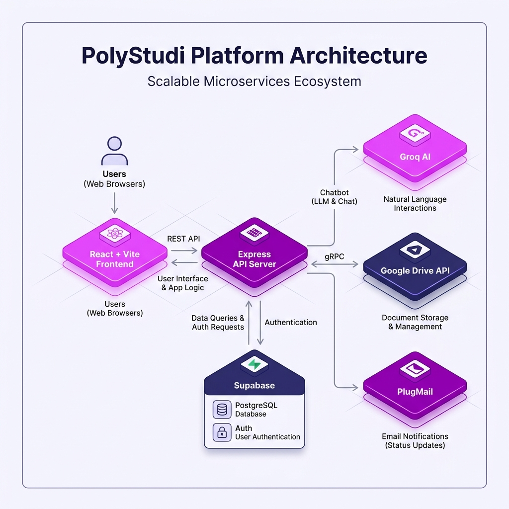
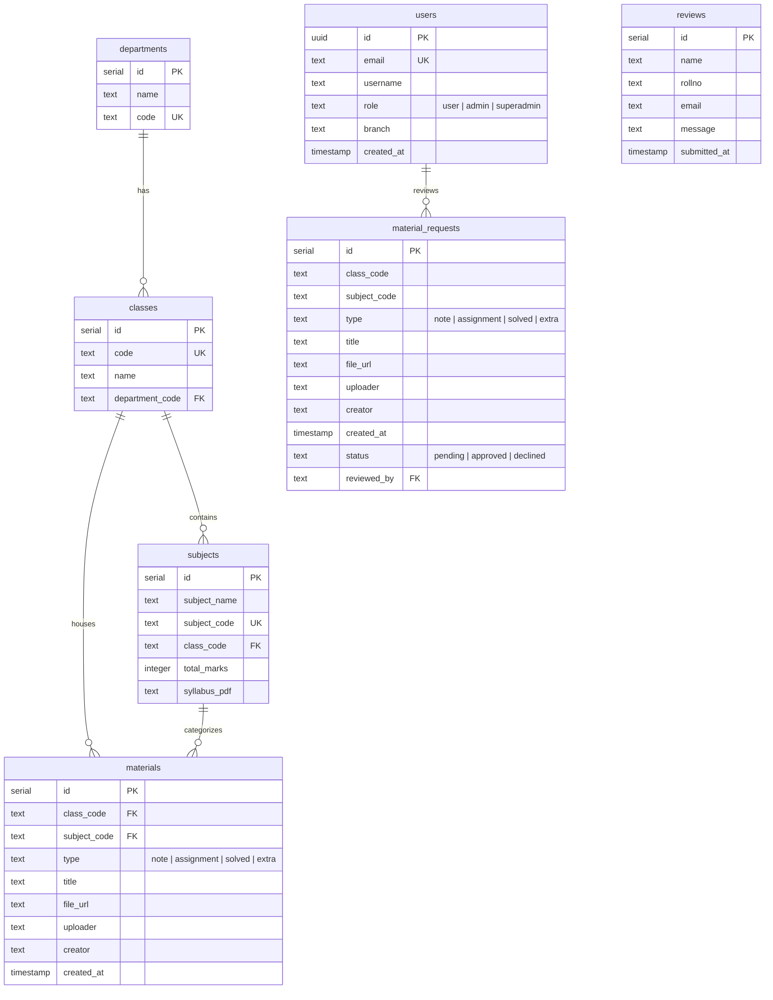
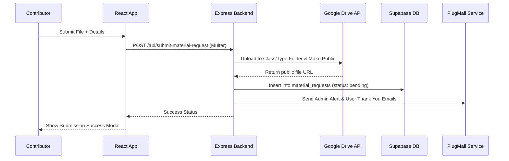
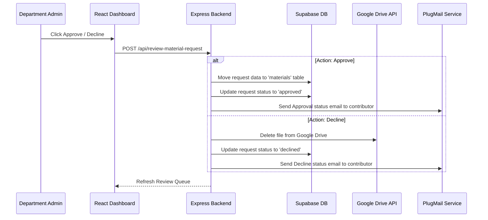

# 🎓 PolyStudi — Academic Resource Hub

> **For Students, By Students.** An elegant, modern, full-stack academic platform helping polytechnic students access notes, solved papers, assignments, and guidance resources.

---

## 🎨 Theme Palette & Design System
PolyStudi's visual design leverages a premium, high-contrast dark-and-light theme optimized for modern readability:
*   **Primary Accent:** `#9102C0` (Vibrant Purple)
*   **Secondary Accent:** `#E040FB` (Bright Orchid Pink)
*   **Dark/Navy Typography:** `#342F76` (Deep Indigo)
*   **Background Base:** `#f8f6ff` (Soft Lavender-White)

---

## 🚀 Key Features

*   **📚 Class-specific Resource Hubs**  
    Dynamic routes for departments and classes (e.g., `CM1K` to `CM6K` for Computer Technology, and `EJ1K` to `EJ5K` for Electronics & Communication). Offers quick filters for notes, assignments, solved papers, and syllabus tables.
*   **📥 Crowdsourced Peer Sharing**  
    Students can request to upload materials. Contributions go through a secure moderation process and are published upon approval.
*   **🤖 PolyBot AI Chatbot**  
    An intelligent Groq-powered chat assistant that parses queries, performs fuzzy matches on course subjects, queries DB resources, and dynamically renders download cards or triggers page navigation.
*   **🛡️ Multi-Tiered Access & Admin Moderation**  
    Roles include `superadmin`, `admin`, and `user`. Admins approve/decline material requests and manage resources, while superadmins manage administrators.
*   **📧 Automated Notifications (PlugMail)**  
    Sends rich HTML status update emails to students (approved/declined) and triggers notifications to specific department admins when new uploads are pending.

---

## 🏗️ System Architecture

PolyStudi uses a decoupled full-stack architecture that combines modern SPA frameworks, dedicated backend handlers, and serverless infrastructure for optimal performance and scale.

### Architecture Diagram

### Technologies
*   **Frontend SPA:** React (v19) + Vite + Tailwind CSS (v4) + GSAP (animations)
*   **Backend Server:** Node.js + Express (handling multer uploads, Google Drive API, chatbot API integrations)
*   **Backend-as-a-Service:** Supabase (Auth, PostgreSQL DB)
*   **Asset Storage:** Google Drive API (hierarchical folder structure per class and material type)
*   **Intelligence Engine:** Groq LLM API (`llama-3.3-70b-versatile` running intent classification and fuzzy matching)
*   **Notification Engine:** PlugMail API (transactional emails)

---

## 📂 Database Schema

PolyStudi is backed by a PostgreSQL database in Supabase, structured as follows:

---

## ⚙️ Core Workflows

### 1. Peer Material Submission Flow

### 2. Admin Review Workflow

---

## 🤝 Open to Contribute

We welcome and encourage contributions to PolyStudi! Whether you'd like to:
*   **Add new features** or optimize the UI/UX.
*   **Contribute academic resources** (notes, question papers, guides).
*   **Report bugs** or suggest enhancements.

Please feel free to open an Issue or submit a Pull Request to get involved in the movement!
